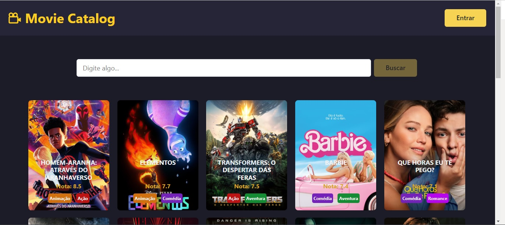
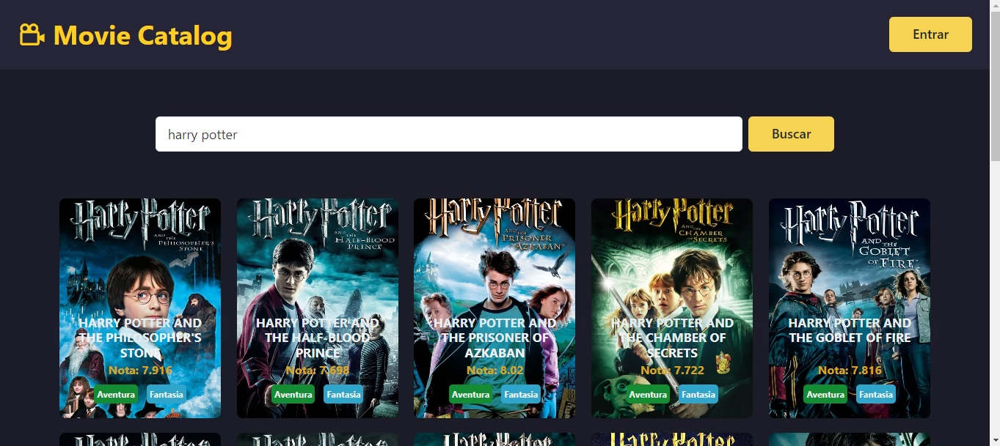
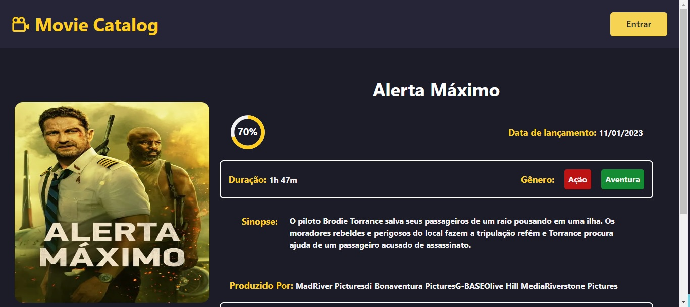
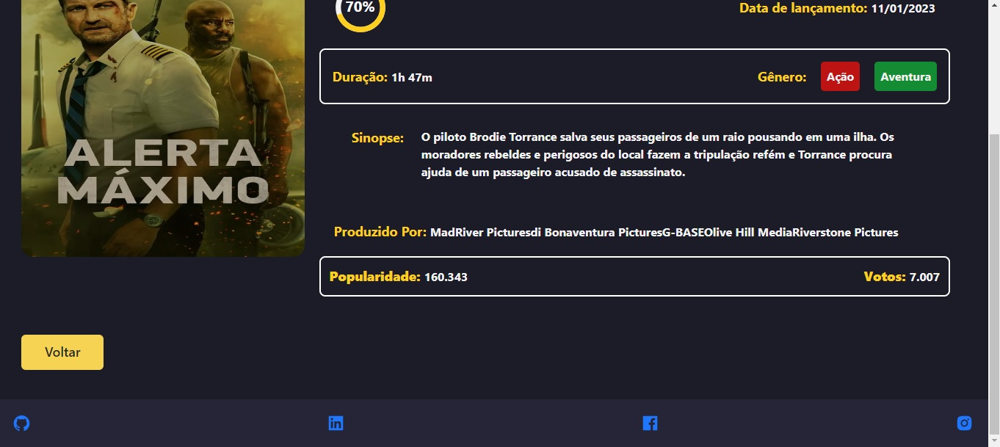

# **Sistema para busca informações de filmes** 

## **Descrição** 
Aplicação front-end para interação visual com a API Tmdb baseado em um Catálogo de filmes. Foram desenvolvidos Cards com imagens, nomes, genêros e nota do público de filmes, onde por meio de um buscador é possível encontrar os cards digitando o seu nome de forma parcial além do mais é possível ver mais detalhes a repeiro do filme ao clicar nele como sinopse, duração, ano de lançamento, entre outras. O Layout foi pensando de forma responsiva para funcionar em desktops, tablets e mobiles, além de possíveis novas funcionalidas como cadastro e login.

<hr>

## **Acessar Aplicação**
[Deploy Movie Catalog](https://movie-catalog-mu.vercel.app/)

<hr>

## **Objetivos**
Criar aplicação com integração na api Tmdb utilizando React com Next e Estlizando com Chakra UI

## **Tecnologias**
Este projeto foi desenvolvido com as seguintes tecnologias: 
- TypeScript;
- React
- Next.js;
- React Hooks;
- Context API;
- Chakra UI;
- date-fns;
- framer-motion;
- Axios

<hr>

## **Requerimentos**
- Node.js;
- npm ou yarn;
- Backend: [https://developer.themoviedb.org/docs](https://developer.themoviedb.org/docs)

## **Instalação**
`npm install`

## Start Projeto

Primeiro, execute o servidor de desenvolvimento:

```bash
npm run dev
# or
yarn dev
```

Abra [http://localhost:3000](http://localhost:3000) com seu navegador para ver o resultado.

## **Clone do Projeto**
https://github.com/WalkerBrum/search-github-profile-react.git

# 📷 Demonstração da Aplicação








## **Autor e Agradecimento**
Eu Walker Lobato como desenvolvedor do projeto sou grato por poder participar desse desafio técnico promovido pela labsif, pois foi um grande oportunidade para o desenvolvimento das minhas hard skills, aprimorando os meus conhecimentos na construção de aplicações web, principalmente em relação a Typescript, Next.js e Chackra UI.
